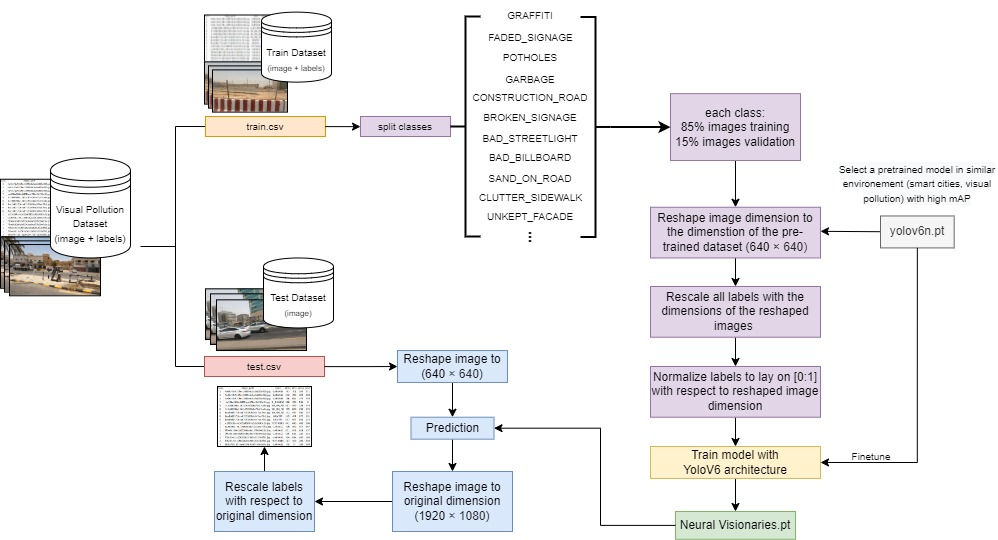

# Smartathon

<p align="center">

</p>


### Make sure to install the required libraries:

```shell
git clone https://github.com/HashemShullar/S_Thon
cd yolov6
pip install -r requirements.txt
```

### To run the demo you can use the following prompt inside the root directory:


```shell
python ./tools/infer.py
```

### Make sure you have the following folder strucutre inside the root directory to run the demo: 
```
├── root directory
│   ├── images
│   │   ├── img_1.jpg
|   |   |  ...
│   │   └── img_n.jpg
│   ├── Neural Visionaries model.pt
│   ├── outputs
│   ├── yolov6
│   ├── tools
|   ├── configs
|   ├── deploy
|   ├── data.yaml
```
Put the images you want to test in the folder: "images". The results will be in the "outputs" folder. You can download the model from the following link: [Model](https://drive.google.com/file/d/1FPg73nBUMC7OD1DESZQr3fYX536iQorL/view?usp=sharing)   

Adapted from: https://github.com/meituan/YOLOv6
